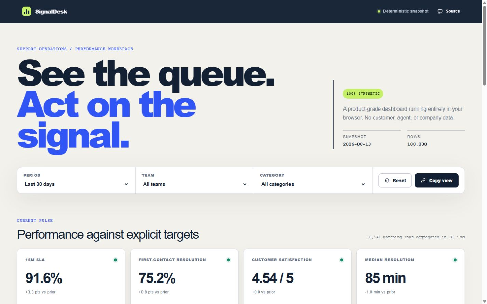
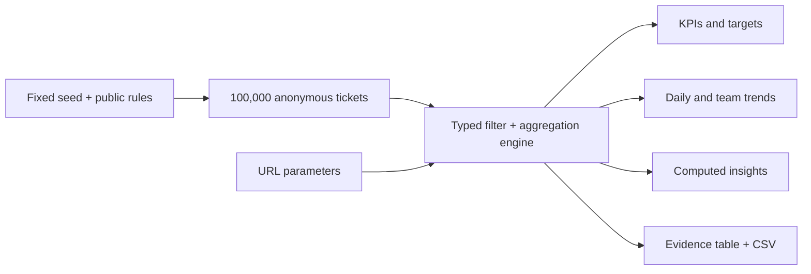

# SignalDesk — support operations analytics

[](https://github.com/jord-andrade/support-ops-analytics/actions/workflows/ci.yml)
[](https://signaldesk-ops.vercel.app)
[](./docs/data-contract.md)
[](./LICENSE)

SignalDesk turns a deterministic, privacy-safe dataset of 100,000 support tickets into a decision workspace. It pairs documented KPIs with targets, shareable filters, computed insights, accessible row-level evidence, and CSV export.

**[Open the live product](https://signaldesk-ops.vercel.app)** · [Read the architecture](./docs/architecture.md) · [Inspect the data contract](./docs/data-contract.md)



## Why this exists

Most dashboard demos stop at attractive charts. SignalDesk is designed to answer the questions that come next:

- What exactly does each KPI mean?
- Is performance above or below an explicit target?
- Which operational decision does the current view support?
- Can a reviewer inspect and export the rows behind the number?
- Can the same filtered view be shared without an account?

The project is a clean-room public case study. It does not reuse the source data, code, names, categories, or history of any private dashboard.

## Product evidence

| Capability | Evidence |
|---|---|
| Privacy | Every record is generated in-browser from seed `20260814`; there are no identity or contact fields |
| Scale | 100,000 rows; CI enforces a 2.5-second generation + full aggregation budget |
| Decision support | Four target-aware KPIs and three insights recomputed from the active slice |
| Traceability | Sortable, paginated evidence table and CSV export of the complete filtered slice |
| Shareability | Period, team, category, and resilience state are serialized in the URL |
| Accessibility | Native controls, table semantics, visible focus, reduced-motion support, and automated axe checks |
| Resilience | Purpose-built loading, empty, error, and success states |

## How it works



The application performs no data request after loading. Generation, aggregation, sorting, pagination, and export all run locally. The dataset is a fixed snapshot ending on `2026-08-13`, which makes screenshots, tests, and reviewer results reproducible.

## KPI definitions

| KPI | Definition | Target |
|---|---|---:|
| 15m SLA | Tickets whose first response is 15 minutes or less ÷ tickets | ≥ 80% |
| First-contact resolution | Tickets resolved during first contact ÷ tickets | ≥ 75% |
| CSAT | Arithmetic mean of the synthetic 1–5 scores | ≥ 4.20 |
| Median resolution | Median minutes from creation to final resolution | ≤ 90 min |

No values are imputed. An empty slice suppresses metrics instead of presenting zeros as performance. The complete schema and generator rules live in [`docs/data-contract.md`](./docs/data-contract.md).

## Run locally

Prerequisites: Node.js 24 and npm 11.

```bash
git clone https://github.com/jord-andrade/support-ops-analytics.git
cd support-ops-analytics
npm ci
npm run dev
```

Open `http://localhost:3000`. Useful commands:

```bash
npm test          # aggregation, privacy, performance, UI semantics, and axe
npm run lint      # Next.js + TypeScript ESLint, zero warnings
npm run typecheck # strict TypeScript without emitting files
npm run build     # production Next.js build
npm run check     # all quality gates above
```

Example shareable view:

```text
/?period=7&team=Delta&category=Playback
```

## Deliberate trade-offs

- The browser owns the analytical workload so the public demo needs no database, account, cookie, or API key.
- The fixed snapshot favors reproducibility over live operational freshness.
- The table paginates DOM rows while CSV export includes the complete filtered result.
- Synthetic relationships are intentionally understandable; they must not be interpreted as benchmarks for a real support organization.

See [`docs/architecture.md`](./docs/architecture.md) for component boundaries, complexity, performance decisions, and failure behavior.

## Repository map

```text
src/app/                 Next.js route, metadata, social image, and styles
src/components/          interactive dashboard and accessibility states
src/lib/analytics.ts     seeded generator, contracts, aggregations, insights, CSV
src/**/*.test.ts(x)      unit, performance, UI, and accessibility evidence
docs/                    architecture, data contract, and product screenshot
.github/workflows/       reproducible CI quality gates
```

## Security and privacy

Please read [`SECURITY.md`](./SECURITY.md) before reporting an issue. The strongest privacy property is structural: the schema has no person, email, phone, free-text message, supervisor, or customer identifier field. A test locks that public schema.

## License

[MIT](./LICENSE) © 2026 Jordan Andrade.
